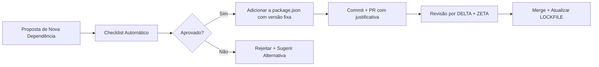

# 📦 DEPENDENCY POLICY

## 🎯 Propósito
Garantir segurança, estabilidade e manutenibilidade no gerenciamento de pacotes.

---

## ✅ Critérios para Adicionar Nova Dependência

Antes de `npm install <package>`, validar:

### 1. Segurança
- [ ] Pacote sem vulnerabilidades críticas (`npm audit --production`)
- [ ] Mantenedor ativo (último commit < 6 meses)
- [ ] ≥ 1.000 downloads/semana (indica adoção da comunidade)

### 2. Compatibilidade com Stack Omega
- [ ] Funciona com Node.js 18+ e Next.js 14+
- [ ] Suporta ESM ou tem interoperabilidade CJS/ESM
- [ ] Não conflita com dependências existentes (`npm ls <package>`)

### 3. Manutenibilidade
- [ ] Documentação clara e exemplos de uso
- [ ] Tipos TypeScript inclusos ou `@types/<package>` disponível
- [ ] Licença permissiva (MIT, Apache 2.0, BSD)

### 4. Custo/Benefício
- [ ] Resolve problema real (não é "nice to have")
- [ ] Não duplica funcionalidade de dependência existente
- [ ] Impacto no bundle size < 50KB (gzipped)

---

## 🔄 Processo de Aprovação



### Template de Proposta (PR Description)
```markdown
## Nova Dependência: `<package-name>`

**Propósito:** [Por que precisamos?]

**Alternativas Consideradas:**
- [ ] `<alternative-1>`: [Por que não?]
- [ ] Implementação própria: [Por que não?]

**Métricas:**
- Tamanho: X KB (gzipped)
- Downloads/semana: Y
- Última atualização: YYYY-MM-DD
- Vulnerabilidades: 0 críticas, Z baixas

**Impacto:**
- Bundle: +X KB
- Build time: +Y segundos
- Runtime: Sem impacto / +Z ms

**Justificativa:** [Resumo em 2-3 frases]
```

---

## 🔒 Regras de Versionamento

### Versões Fixas (Sempre)
```json
{
  "dependencies": {
    "next": "14.2.22",
    "react": "18.3.1",
    "zod": "3.24.1"
  }
}
```
- 🚫 Nunca usar `^` ou `~` para dependências críticas.
- ✅ Usar versão exata para reprodutibilidade.

### Atualizações
| Tipo de Atualização | Frequência | Aprovação Necessária |
|-------------------|-----------|---------------------|
| Patch (`1.2.3` → `1.2.4`) | Mensal (automático via Dependabot) | Nenhum (se testes passarem) |
| Minor (`1.2.3` → `1.3.0`) | Trimestral | DELTA (revisão de breaking changes) |
| Major (`1.2.3` → `2.0.0`) | Sob demanda | DELTA + ZETA + teste em staging |

---

## 🧪 Validação Pré-Commit

Script `scripts/validate-deps.sh`:
```bash
#!/bin/bash
# Validar dependências antes de commit

echo "🔍 Validando dependências..."

# 1. Audit de segurança
if ! npm audit --production --audit-level=high --json | jq -e '.metadata.vulnerabilities.critical == 0'; then
  echo "❌ Vulnerabilidades críticas detectadas!"
  exit 1
fi

# 2. Verificar versões fixas
if grep -E '"[\^~][0-9]' package.json | grep -v "node_modules"; then
  echo "❌ Versões com ^ ou ~ detectadas. Use versões fixas."
  exit 1
fi

# 3. Verificar lockfile
if [ ! -f package-lock.json ] || ! npm ci --dry-run > /dev/null 2>&1; then
  echo "❌ package-lock.json ausente ou inconsistente."
  exit 1
fi

echo "✅ Dependências validadas."
```

---

## 🗑️ Remoção de Dependências

### Critérios para Remover
- [ ] Não utilizada há ≥ 90 dias (`depcheck` ou similar)
- [ ] Substituída por dependência da Stack Omega
- [ ] Vulnerabilidade crítica sem patch disponível
- [ ] Pacote descontinuado ou abandonado

### Processo de Remoção
1. Buscar usos no código: `grep -r "<package>" src/`
2. Substituir por alternativa ou remover funcionalidade
3. Remover de `package.json` + `npm install`
4. Commitar com mensagem: `chore(deps): remove <package> — [justificativa]`

---

## 📊 Monitoramento Contínuo

### Dashboard de Dependências (ZETA)
- ✅ Alertar se:
  - Pacote crítico sem atualização há > 6 meses
  - Nova vulnerabilidade crítica publicada
  - Bundle size cresceu > 10% após nova dependência

### Relatório Trimestral
```json
{
  "total_dependencies": 42,
  "critical_stack": 12,
  "optional": 30,
  "outdated": {
    "patch_available": 5,
    "minor_available": 2,
    "major_available": 1
  },
  "security": {
    "critical": 0,
    "high": 0,
    "medium": 2,
    "low": 5
  },
  "bundle_impact": {
    "total_size_gzipped": "1.2MB",
    "top_5_largest": [
      { "package": "next", "size": "320KB" },
      { "package": "react", "size": "120KB" }
    ]
  }
}
```

---

## ⚠️ Dependências Proibidas

| Pacote | Motivo | Alternativa Stack Omega |
|--------|--------|------------------------|
| `axios` | Next.js tem `fetch` nativo + Vercel AI SDK | `fetch` ou `@ai-sdk/react` |
| `moment.js` | Pesado, descontinuado | `date-fns` ou `Intl.DateTimeFormat` |
| `lodash` (completo) | Bundle size grande | Importar funções específicas: `import debounce from 'lodash/debounce'` |
| `styled-components` | Conflita com Tailwind | Tailwind CSS + `class-variance-authority` |
| `firebase` | Vendor lock-in, custo imprevisível | Clerk (auth) + Neon (DB) + Vercel (hosting) |

---

**Status:** ✅ Ativo | **Validação:** Executada em pré-commit + CI/CD
