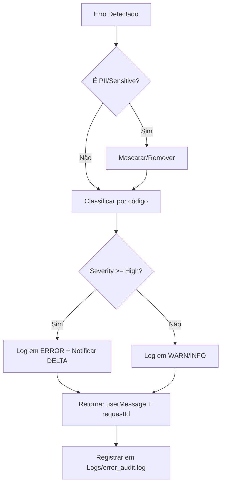

# 🛡️ ERROR HANDLING STANDARD

## 🎯 Propósito
Garantir consistência, rastreabilidade e segurança no tratamento de erros em todos os agentes e camadas.

---

## 📋 Schema de Erro (Zod)

```typescript
// src/lib/errors/schema.ts
import { z } from 'zod';

export const ErrorSchema = z.object({
  // Metadados obrigatórios
  requestId: z.string().uuid(),
  timestamp: z.string().datetime(),
  agent: z.enum(['THETA', 'ALPHA', 'BETA', 'GAMMA', 'DELTA', 'EPSILON', 'ETA', 'ZETA']),
  skill: z.string().optional(),
  
  // Classificação
  code: z.enum([
    'VALIDATION_ERROR',
    'AUTHENTICATION_ERROR',
    'AUTHORIZATION_ERROR',
    'NOT_FOUND',
    'RATE_LIMIT_EXCEEDED',
    'EXTERNAL_API_ERROR',
    'DATABASE_ERROR',
    'LLM_ERROR',
    'UNKNOWN_ERROR'
  ]),
  severity: z.enum(['low', 'medium', 'high', 'critical']),
  
  // Mensagens
  userMessage: z.string().max(200),  // Amigável, sem detalhes técnicos
  developerMessage: z.string().optional(),  // Apenas em logs internos
  
  // Contexto (sanitizado)
  context: z.record(z.unknown()).refine(
    (ctx) => !Object.values(ctx).some(v => typeof v === 'string' && /[\w.-]+@[\w.-]+\.\w+/.test(v)),
    "Contexto não pode conter PII"
  ).optional(),
  
  // Recuperação
  retryable: z.boolean().default(false),
  suggestedAction: z.string().optional(),
  
  // Rastreabilidade
  cause: z.unknown().optional(),  // Erro original (apenas em dev)
  stack: z.string().optional(),   // Stack trace (apenas em dev)
});

export type AntigravityError = z.infer<typeof ErrorSchema>;
```

---

## 🔄 Fluxo de Tratamento



---

## 📝 Exemplos de Uso

### API Route
```typescript
// app/api/users/route.ts
import { AntigravityError, ErrorSchema } from '@/lib/errors/schema';

export async function GET(req: Request) {
  try {
    const users = await db.query.users.findMany();
    return Response.json({ success: true, data: users });
  } catch (error) {
    const antigravityError: AntigravityError = {
      requestId: crypto.randomUUID(),
      timestamp: new Date().toISOString(),
      agent: 'GAMMA',
      skill: '03_executando_planos',
      code: 'DATABASE_ERROR',
      severity: 'high',
      userMessage: 'Não foi possível carregar os usuários. Tente novamente.',
      developerMessage: error instanceof Error ? error.message : 'Unknown',
      context: { operation: 'users.list' },
      retryable: true,
      suggestedAction: 'Verificar conexão com Neon'
    };
    
    // Validar schema antes de logar
    ErrorSchema.parse(antigravityError);
    
    logger.error('users_list_failed', antigravityError);
    
    return Response.json(
      { 
        success: false, 
        error: {
          code: antigravityError.code,
          message: antigravityError.userMessage,
          requestId: antigravityError.requestId
        }
      },
      { status: 500 }
    );
  }
}
```

### Server Action
```typescript
// src/lib/actions/create-user.ts
'use server';

export async function createUser(input: unknown) {
  try {
    const validated = CreateUserSchema.parse(input);
    const user = await db.insert(users).values(validated).returning();
    return { success: true, data: user[0] };
  } catch (error) {
    if (error instanceof z.ZodError) {
      return {
        success: false,
        error: {
          code: 'VALIDATION_ERROR',
          message: 'Dados inválidos',
          details: error.errors.map(e => ({ field: e.path.join('.'), message: e.message }))
        }
      };
    }
    
    // Erro não esperado — logar e retornar genérico
    logger.error('create_user_failed', {
      requestId: crypto.randomUUID(),
      code: 'UNKNOWN_ERROR',
      severity: 'critical',
      userMessage: 'Erro interno ao criar usuário',
      context: { inputKeys: Object.keys(input as object) } // Sem valores reais!
    });
    
    return {
      success: false,
      error: {
        code: 'UNKNOWN_ERROR',
        message: 'Erro interno. Contate o suporte.'
      }
    };
  }
}
```

---

## 🚨 Códigos de Erro e Ações

| Código | Descrição | Ação Automática | Notificar |
|--------|-----------|----------------|-----------|
| `VALIDATION_ERROR` | Dados de entrada inválidos | Retornar 400 + detalhes sanitizados | — |
| `AUTHENTICATION_ERROR` | Token inválido/expirado | Retornar 401 + redirect para login | — |
| `AUTHORIZATION_ERROR` | Usuário sem permissão | Retornar 403 + log de tentativa | DELTA (se >5/min) |
| `NOT_FOUND` | Recurso não existe | Retornar 404 | — |
| `RATE_LIMIT_EXCEEDED` | Limite de requests estourado | Retornar 429 + `Retry-After` header | ZETA (otimizar) |
| `EXTERNAL_API_ERROR` | Falha em provider externo | Retry exponencial (3x) + fallback | ETA (se persistente) |
| `DATABASE_ERROR` | Falha de conexão/query | Retry (1x) + retornar 500 | ETA + DELTA |
| `LLM_ERROR` | Falha na chamada de IA | Fallback para modelo menor + log | ZETA (ajustar routing) |
| `UNKNOWN_ERROR` | Erro não mapeado | Retornar 500 genérico + alertar | DELTA (investigar) |

---

## 📊 Métricas de Qualidade

- ✅ **100%** dos erros retornam `requestId` para rastreabilidade.
- ✅ **0%** de PII em logs de erro em produção.
- ✅ **< 1s** latência adicional por tratamento de erro.
- ✅ **≥ 95%** dos erros `retryable` têm retry implementado.

---

**Status:** ✅ Ativo | **Integração:** Carregado por todos os agentes no startup
