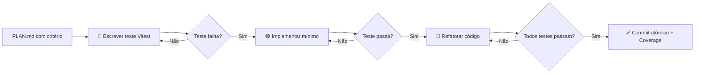

# 03 - TDD RED-GREEN-REFACTOR (Test-First Protocol)

## 🎯 Quando usar
- **Sempre** antes de implementar nova lógica de negócio
- Quando `02_planejando_solucoes` define critérios de aceite complexos
- Para refatorar código legado com segurança
- Quando `04_solucionando_erros` identifica bug recorrente

> **Regra de Ouro**: NUNCA escreva código de produção sem um teste falhando primeiro. **RED → GREEN → REFACTOR** é obrigatório.

## 🧱 Stack Omega de Testing

| Camada | Tecnologia | Propósito |
|:---|:---|:---|
| **Unit Tests** | Vitest + Testing Library | Lógica pura, funções, hooks |
| **Integration** | Vitest + Prisma Test Utils | API Routes, Server Actions, DB |
| **E2E** | Playwright | Fluxos completos do usuário |
| **Visual** | Chromatic / Argos | Regressão visual de componentes |
| **Coverage** | Vitest --coverage + codecov | Métricas de qualidade |
| **Mocking** | Vitest mocks + MSW | APIs externas, serviços |

## ⚙️ Ciclo TDD Obrigatório (3 Fases)

### 🔴 FASE 1: RED (Escreva o Teste Falhando)

**Objetivo:** Definir comportamento esperado ANTES da implementação.

```typescript
// 1. Entenda o requisito do PLAN.md
// Ex: "Usuário não pode criar conta com email já cadastrado"

// 2. Escreva o teste PRIMERO
// __tests__/lib/auth/register.test.ts
import { describe, it, expect, beforeEach, vi } from 'vitest';
import { registerUser } from '@/lib/auth/register';
import { prisma } from '@/lib/prisma';

describe('registerUser', () => {
  beforeEach(() => {
    vi.clearAllMocks();
  });

  it('deve rejeitar registro com email duplicado', async () => {
    // Arrange: Simula email existente no DB
    vi.spyOn(prisma.user, 'findUnique').mockResolvedValue({
      id: 'existing-user-id',
      email: 'teste@example.com',
      // ... outros campos
    });

    // Act + Assert: Espera que a função lance erro específico
    await expect(
      registerUser({ email: 'teste@example.com', password: 'Senha123!' })
    ).rejects.toThrow('Email já cadastrado');
  });
});
```

**Checklist RED:**
- [ ] Teste descreve UM comportamento específico
- [ ] Nome do teste é legível como frase: `it('deve fazer X quando Y')`
- [ ] Usa Arrange-Act-Assert (AAA) claramente
- [ ] Mocka dependências externas (DB, APIs)
- [ ] **RODA E FALHA** (confirma que teste detecta ausência da feature)

### 🟢 FASE 2: GREEN (Implemente o Mínimo para Passar)

**Objetivo:** Escrever código de produção APENAS para fazer o teste passar.

```typescript
// lib/auth/register.ts - Implementação mínima
import { prisma } from '@/lib/prisma';
import { z } from 'zod';

const RegisterSchema = z.object({
  email: z.string().email(),
  password: z.string().min(8),
});

export async function registerUser(input: unknown) {
  const validated = RegisterSchema.parse(input);
  
  // ✅ Implementação que faz o teste passar
  const existing = await prisma.user.findUnique({
    where: { email: validated.email }
  });
  
  if (existing) {
    throw new Error('Email já cadastrado');
  }
  
  // ... restante da lógica
}
```

**Checklist GREEN:**
- [ ] Código faz APENAS o teste passar (sem otimizações prematuras)
- [ ] Zero `console.log` ou código de debug
- [ ] Tipos TypeScript corretos (sem `any`)
- [ ] **RODA E PASSA** (teste verde)
- [ ] Lint e typecheck sem erros

### 🔵 FASE 3: REFACTOR (Melhore sem Mudar Comportamento)

**Objetivo:** Limpar código, extrair funções, melhorar legibilidade — COM TESTES PASSANDO.

```typescript
// Após refatoração: código mais limpo, mesma funcionalidade
// lib/auth/register.ts
import { prisma } from '@/lib/prisma';
import { RegisterInputSchema } from '@/lib/schemas/auth';

export async function registerUser(input: unknown) {
  const { email, password } = RegisterInputSchema.parse(input);
  
  await validateEmailAvailability(email); // ← Extraído para função dedicada
  
  return createUserWithDefaults({ email, password });
}

// lib/auth/validators.ts ← Nova função extraída
export async function validateEmailAvailability(email: string) {
  const existing = await prisma.user.findUnique({ where: { email } });
  if (existing) {
    throw new DuplicateEmailError(email); // ← Erro customizado
  }
}
```

**Checklist REFACTOR:**
- [ ] Todos os testes ainda passam após mudanças
- [ ] Código segue padrões `06_codando.md` (DRY, naming, etc.)
- [ ] Funções extraídas têm responsabilidade única
- [ ] Erros customizados para melhor DX (`DuplicateEmailError`)
- [ ] Cobertura de testes mantida ou melhorada

## 🔄 Fluxo Completo com Stack Omega



## 📋 Template de Teste Vitest (Copiar & Adaptar)

```typescript
// __tests__/[feature]/[module].test.ts
import { describe, it, expect, beforeEach, vi, afterEach } from 'vitest';
import { [FUNCTION_TO_TEST] } from '@/lib/[module]';
import { prisma } from '@/lib/prisma';

describe('[FEATURE_NAME]', () => {
  // Setup: limpar mocks antes de cada teste
  beforeEach(() => {
    vi.clearAllMocks();
  });

  afterEach(() => {
    vi.restoreAllMocks();
  });

  describe('[SUB_FEATURE]', () => {
    it('deve [comportamento esperado] quando [condição]', async () => {
      // 🟦 ARRANGE: Preparar dados e mocks
      const mockInput = { /* ... */ };
      vi.spyOn(prisma.[model], '[method]').mockResolvedValue(/* ... */);

      // 🟨 ACT: Executar função sob teste
      const result = await [FUNCTION_TO_TEST](mockInput);

      // 🟩 ASSERT: Verificar resultado
      expect(result).toEqual(/* ... */);
      expect(prisma.[model].[method]).toHaveBeenCalledWith(/* ... */);
    });

    it('deve lançar [ErroEspecífico] quando [condição de erro]', async () => {
      // Teste de caminho de erro
      await expect(
        [FUNCTION_TO_TEST]({ /* dados inválidos */ })
      ).rejects.toThrow([ErroEspecífico]);
    });
  });
});
```

## 🎯 Integração com Agentes

| Agente | Papel no TDD |
|--------|-------------|
| **BETA** | Define critérios de aceite testáveis no PLAN.md |
| **DELTA** | **Dono desta skill** — valida ciclo RED→GREEN→REFACTOR |
| **GAMMA** | Implementa código seguindo testes (não inventa features) |
| **ETA** | Usa testes para reproduzir e validar fix de bugs |
| **ZETA** | Otimiza suite de testes (parallel execution, caching) |

## 🚫 Anti-Padrões (Proibidos)

- ❌ Escrever código de produção antes do teste (TDD invertido)
- ❌ Testes que dependem de ordem de execução
- ❌ Mockar tudo (teste vira teste do mock, não do sistema)
- ❌ Ignorar testes de erro/caminhos alternativos
- ❌ Commit sem rodar `npm run test` localmente
- ❌ Cobertura < 80% em lógica de negócio crítica

## ✅ Checklist de Qualidade DELTA

Antes de aprovar PR com código novo:

- [ ] **RED**: Teste escrito primeiro e falhando intencionalmente
- [ ] **GREEN**: Implementação mínima que faz teste passar
- [ ] **REFACTOR**: Código limpo, funções extraídas, sem duplicação
- [ ] **Coverage**: `npm run test -- --coverage` mostra >80% na feature
- [ ] **Isolation**: Testes rodam em qualquer ordem, sem side-effects
- [ ] **Naming**: Nomes de teste legíveis como documentação viva
- [ ] **Mocks**: Apenas dependências externas mockadas (não lógica interna)
- [ ] **CI**: Pipeline GitHub Actions/Vercel passa com testes

## 📊 Métricas de Sucesso

| Métrica | Alvo | Como Medir |
|---------|------|-----------|
| Test Coverage | >80% lógica de negócio | `vitest --coverage` + codecov |
| Test Execution Time | <30s suite completa | `vitest --reporter=verbose` |
| Flaky Tests | 0% | CI pipeline histórico |
| Time to Detect Bug | <5min (testes locais) | Feedback loop do desenvolvedor |
| Refactor Safety | 100% testes verdes pós-mudança | `git diff` + `npm test` |

## 🔗 Integração com Sistema v3.1

**Roteamento:** Invocada via `/tdd` ou por DELTA durante auditoria.

**Memória:** Erros de teste recorrentes → registrar em `.antigravity-os/[04] MEMORY_DNA/`.

**Budget:** Testes não contam para budget de código — são investimento obrigatório.

**Handoff:** Após TDD completo, retornar a `03_executando_planos.md` para próxima feature.

---

## 🔗 INTEGRAÇÃO COM ANTIGRAVITY OS v3.1

**Roteamento:** Esta skill é invocada via `.antigravity-os/[02] SQUAD_WRAPPERS/` ou Slash Commands.

**Memória:** Erros encontrados devem ser logados em `.antigravity-os/[04] MEMORY_DNA/[00] error-dna-registry.json`.

**Budget:** Respeite os limites de `.antigravity-os/[00] KERNEL/[02] token-budget-controller.json`.

**Handoff:** Após execução, atualize `context/CURRENT_AGENT.md` e retorne ao THETA.

**Stack Omega:** Siga rigorosamente `Minhas_Rules/STACK_OMEGA_RULES.md`.
